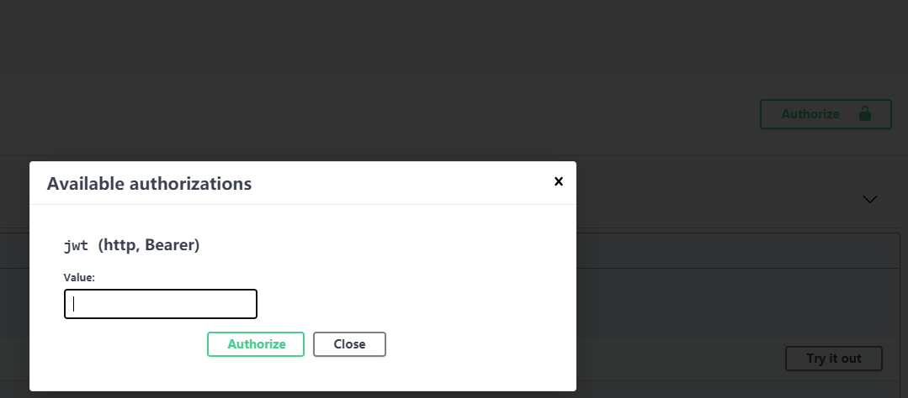

## Specification

If you need the complete Specification, go to http://127.0.0.1:5000/openapi/openapi.json

## command: flask openapi

*New in v2.0.0*

The `flask openapi` command will export the OpenAPI Specification to console when you execute the command:

```
flask openapi
```

Execute `flask openapi --help` for more information:

```
flask openapi --help

Usage: flask openapi [OPTIONS]

  Export the OpenAPI Specification to console or a file

Options:
  -o, --output PATH               The output file path.
  -f, --format [json|yaml|markdown]
                                  The output file format.
  -i, --indent INTEGER            The indentation for JSON dumps.
  -a, --ensure_ascii              Ensure ASCII characters or not. Defaults to
                                  False.
  --help                          Show this message and exit.

```

!!! info

    You need to manually install `pyyaml` using pip:
    ```bash
    pip install flask-openapi3[yaml]
    
    # or
    pip install pyyaml
    ```

## info

**`flask-openapi3`** provide [Swagger UI](https://github.com/swagger-api/swagger-ui), [Redoc](https://github.com/Redocly/redoc) and [RapiDoc](https://github.com/mrin9/RapiDoc) interactive documentation.
Before that, you should know something about the [OpenAPI Specification](https://spec.openapis.org/oas/v3.0.3).

You must import **`Info`** from **`flask-openapi3`**, it needs some parameters: **`title`**, **`version`**... , more information see the [OpenAPI Specification Info Object](https://spec.openapis.org/oas/v3.0.3#info-object).

```python hl_lines="4 5"
from flask_openapi3 import Info
from flask_openapi3 import OpenAPI, APIBlueprint

info = Info(title='book API', version='1.0.0')
app = OpenAPI(__name__, info=info)
api = APIBlueprint('/book', __name__, url_prefix='/api')

if __name__ == '__main__':
    app.run()
```

run it, and go to http://127.0.0.1:5000/openapi, you will see the documentation.


## security_schemes

Like [Info](#info), import **`HTTPBearer`** from **`flask_openapi3`**, more features see the [OpenAPI Specification Security Scheme Object](https://spec.openapis.org/oas/v3.0.3#security-scheme-object).

First, you need define the **security_schemes**  and **security** variable:

```python
security_schemes = {"jwt": HTTPBearer(bearerFormat="JWT")}
security = [{"jwt": []}]

app = OpenAPI(__name__, info=info, security_schemes=security_schemes)
```

Second, add pass the **security** to your api, like this:

```python hl_lines="1"
@app.get('/book/<int:bid>', tags=[book_tag], security=security)
def get_book(path: Path, query: BookBody):
    ...
```

result:



### abp_security

*New in v0.9.3*

You don't need to specify **security** for every api.

```python hl_lines="3"
tag = Tag(name='book', description="Some Book")
security = [{"jwt": []}]
api = APIBlueprint('/book', __name__, abp_tags=[tag], abp_security=security)


@api.post('/book')
def create_book(body: BookBody):
    ...
```

## oauth_config

*New in v0.9.4*

You can pass `oauth_config` when initializing `OpenAPI`:

```python
from flask_openapi3 import OpenAPI, OAuthConfig
from flask_openapi3 import Info
from flask_openapi3 import OAuth2, OAuthFlows, OAuthFlowImplicit

info = Info(title='oauth API', version='1.0.0')

oauth_config = OAuthConfig(
    clientId="xxx",
    clientSecret="xxx"
)

oauth2 = OAuth2(flows=OAuthFlows(
    implicit=OAuthFlowImplicit(
        authorizationUrl="https://example.com/api/oauth/dialog",
        scopes={
            "write:pets": "modify pets in your account",
            "read:pets": "read your pets"
        }
    )))
security_schemes = {"oauth2": oauth2}

app = OpenAPI(__name__, info=info, oauth_config=oauth_config, security_schemes=security_schemes)

security = [
    {"oauth2": ["write:pets", "read:pets"]}
]


@app.get("/", security=security)
def oauth():
    return "oauth"


if __name__ == '__main__':
    app.run(debug=True)
```

Here's more information about [OAuth 2.0 configuration](https://github.com/swagger-api/swagger-ui/blob/master/docs/usage/oauth2.md)

## responses

*New in v0.9.4*

You can add `responses` for each API under the `app` wrapper.

```python hl_lines="4"
app = OpenAPI(
    __name__, 
    info=info, 
    responses={"404": NotFoundResponse}
)

@app.get(...)
def endpoint():
    ...
```

### abp_responses

*New in v0.9.4*

You can add `responses` for each API under the `api` wrapper.

```python hl_lines="10"
class Unauthorized(BaseModel):
    code: int = Field(-1, description="Status Code")
    message: str = Field("Unauthorized!", description="Exception Information")


api = APIBlueprint(
    '/book', 
    __name__, 
    url_prefix='/api',
    abp_responses={"401": Unauthorized}
)

@api.get(...)
def endpoint():
    ...
```

You can also use [responses ](./Response.md#responses) and [extra_responses](./Response.md#extra_responses) in your api.

## doc_ui

You can pass `doc_ui=False` to disable the `OpenAPI spec` when init `OpenAPI `.

```python
app = OpenAPI(__name__, info=info, doc_ui=False)
```

*New in v0.9.4*

You can also use `doc_ui` in endpoint or when initializing `APIBlueprint`.

```python hl_lines="4 9"
api = APIBlueprint(
    '/book',
    __name__,
    doc_ui=False
)

# or

@api.get('/book', doc_ui=False)
def get_book():
    ...
```

## doc_expansion

Just for Swagger UI.

String=["list", "full", "none"].

Controls the default expansion setting for the operations and tags. It can be 'list' (expands only the tags), full' (expands the tags and operations) or 'none' (expands nothing).

More information to see [Configuration](https://github.com/swagger-api/swagger-ui/blob/master/docs/usage/configuration.md).

```python
app = OpenAPI(__name__, info=info, doc_expansion='full')
```

## Interactive documentation

**Flask OpenAPI3** provides support to the following Interactive documentation:

- [Swagger](https://github.com/swagger-api/swagger-ui)
- [Redoc](https://github.com/Redocly/redoc)
- [RapiDoc](https://github.com/mrin9/RapiDoc)

The following are the default values of these configurations. Of course, you can change them:

- doc_prefix = "/openapi"
- api_doc_url = "/openapi.json"
- swagger_url= "/swagger"
- redoc_url = "/redoc"
- rapidoc_url = "/rapidoc"

## servers

An array of Server Objects, which provide connectivity information to a target server. If the server's property is not provided, or is an empty array, the default value would be a Server Object with an url value of /.

```python
from flask_openapi3 import OpenAPI, Server

servers = [
    Server(url='http://127.0.0.1:5000'),
    Server(url='https://127.0.0.1:5000'),
]
app = OpenAPI(__name__, info=info, servers=servers)
```

## external_docs

Allows referencing an external resource for extended documentation.

More information to see [External Documentation Object](https://spec.openapis.org/oas/v3.0.3#external-documentation-object).

```python
from flask_openapi3 import OpenAPI, ExternalDocumentation

external_docs=ExternalDocumentation(
    url="https://www.openapis.org/",
    description="Something great got better, get excited!"
)
app = OpenAPI(__name__, info=info, external_docs=external_docs)
```

